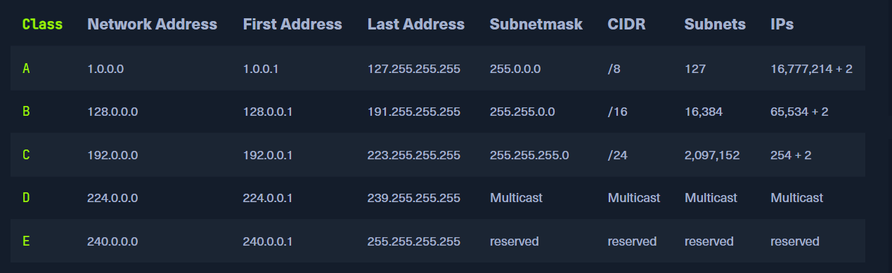
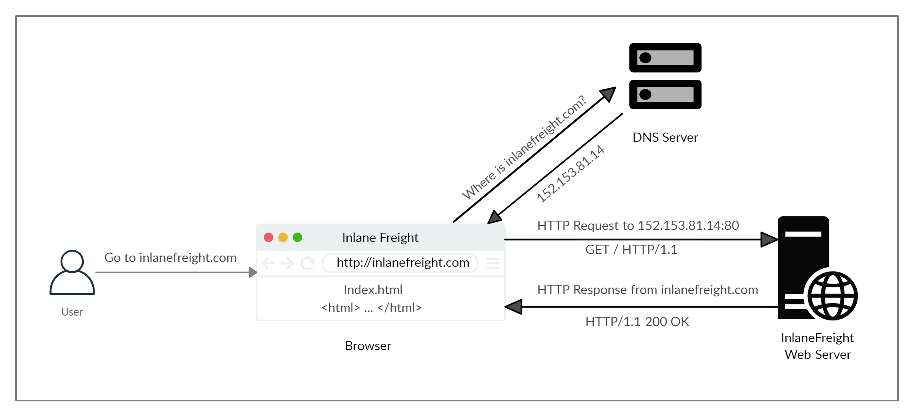
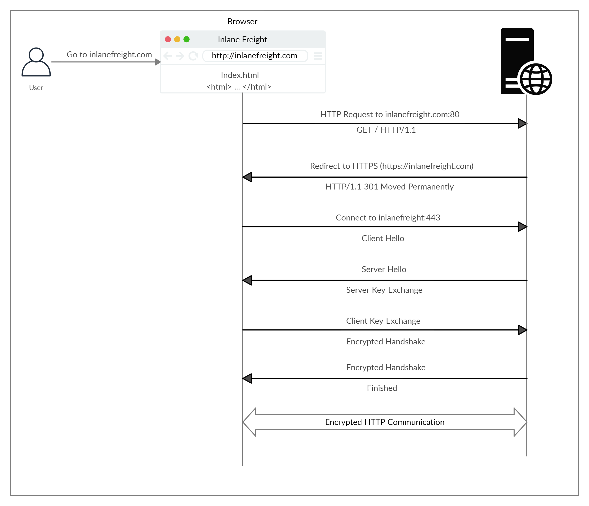

# Networking

## Network Layers
1. The network layer (Layer 3) of OSI controls the exchange of data packets, as these cannot be directly routed to the receiver and therefore have to be provided with routing nodes.

2.  The data packets are then transferred from node to node until they reach their target.

3. To implement this, the network layer identifies the individual network nodes, sets up and clears connection channels, and takes care of routing and data flow control.

4.  When sending the packets, addresses are evaluated, and the data is routed through the network from node to node. There is usually no processing of the data in the layers above the L3 in the nodes.

5.  Based on the addresses, the routing and the construction of routing tables are done.

## Ports
1. Ports are numerical identifiers (ranging from 0 to 65535) used in networking to distinguish different services or applications on the same server.

2. If your web server is behind a router or firewall, you might need to set up port forwarding to direct incoming traffic on specific ports (like 80 or 443) to your server.

3. Use tools like `netstat` or `ss` to check which ports are currently in use on your server and manage them accordingly.

4. Ports use a protocol to direct traffic from them. Ports can be used with either the `Transmission Control Protocol (TCP)` or the `User Datagram Protocol (UDP)`.

4. `Network Address Translation (NAT)`: Often works with port forwarding to enable multiple devices on a local network to share a single public IP address while directing incoming requests to the correct internal device.

## IP Addresses
1. Each host in the network can be identified by the so-called Media Access Control address (MAC). This would allow data exchange within this one network. If the remote host is located in another network, knowledge of the MAC address is not enough to establish a connection.

2. Addressing on the Internet is done via the IPv4 and/or IPv6 address, which is made up of the `network address` and the `host address`.

3. The IP network blocks were divided into classes A - E.

### Subnetting
1. A further separation of these classes into small networks is done with the help of `subnetting`. This separation is done using the netmasks, which is as long as an IPv4 address. As with classes, it describes which bit positions within the IP address act as network part or host part.

### Network and Gateway Addresses
1. The two additional IPs added in the IPs column are reserved for the so-called network address and the broadcast address.

2. Another important role plays the default gateway, which is the name for the IPv4 address of the router that couples networks and systems with different protocols and manages addresses and transmission methods. It is common for the default gateway to be assigned the first or last assignable IPv4 address in a subnet.

### Broadcast Address
1. The broadcast IP address's task is to connect all devices in a network with each other.

2. Broadcast in a network is a message that is transmitted to all participants of a network and does not require any response. In this way, a host sends a data packet to all other participants of the network simultaneously and, in doing so, communicates its IP address, which the receivers can use to contact it.

3. This is the last IPv4 address that is used for the broadcast.

## HTTP

1. The diagram above presents the anatomy of an HTTP request at a very high level. The first time a user enters the URL (inlanefreight.com) into the browser, it sends a request to a DNS (Domain Name Resolution) server to resolve the domain and get its IP. The DNS server looks up the IP address for inlanefreight.com and returns it. All domain names need to be resolved this way, as a server can't communicate without an IP address.

2. Our browsers usually first look up records in the local `/etc/hosts` file, and if the requested domain does not exist within it, then they would contact other DNS servers.

3. A request is sent to port 80 first, which is the `unencrypted HTTP protocol`. The server detects this and redirects the client to secure `HTTPS port 443` instead. This is done via the `301 Moved Permanently` response code.

### HTTP Response codes

| Signal      | Description                          |
| ----------- | ------------------------------------ |
| `GET`       | Requests a specific resource. Additional data can be passed to the server via query strings in the URL (e.g. ?param=value). |
| `POST`       | Sends data to the server. It can handle multiple types of input, such as text, PDFs, and other forms of binary data. This data is appended in the request body present after the headers. The POST method is commonly used when sending information (e.g. forms/logins) or uploading data to a website, such as images or documents. |
| `HEAD`       | Requests the headers that would be returned if a GET request was made to the server. It doesn't return the request body and is usually made to check the response length before downloading resources. |
| `PUT`       | Creates new resources on the server. Allowing this method without proper controls can lead to uploading malicious resources. |
| `DELETE`       | Deletes an existing resource on the webserver. If not properly secured, can lead to Denial of Service (DoS) by deleting critical files on the web server. |
| `OPTIONS`       | Returns information about the server, such as the methods accepted by it. |
| `PATCH`       | Applies partial modifications to the resource at the specified location. |
